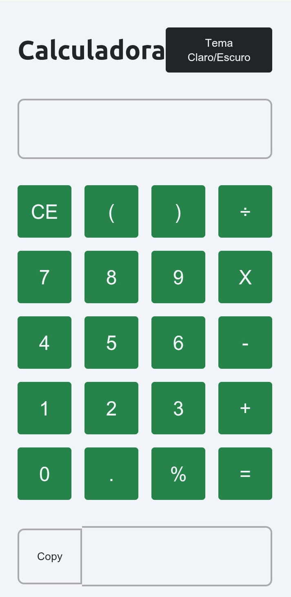
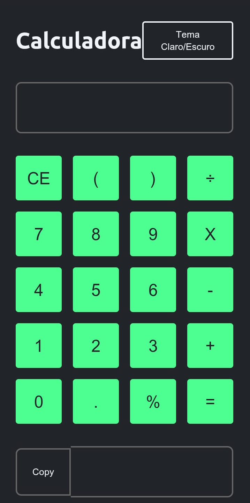

[Experimente!!!](https://drmqueiroz1.github.io/Calculadora/)

# Calculadora (Calculator)

Este é um projeto de Calculadora (Calculator) desenvolvido como parte das aulas do curso da OnebitCode. Neste projeto, criamos uma versão digital de uma Calculadora, 
onde podemos efetuar as quatro operações básicas, além de possuir dois temas de exibição (Claro/Escuro). 

  

  

## Descrição do Projeto
Uma calculadora interativa e responsiva, desenvolvida utilizando HTML, CSS e JavaScript, oferece uma interface amigável para a realização de operações aritméticas básicas.
Este projeto é uma excelente demonstração de como HTML, CSS e JavaScript podem ser combinados para criar aplicações web interativas e funcionais.

## Funcionalidades Principais
- Operações Básicas: Adição, subtração, multiplicação e divisão.
- Display Interativo: Exibição clara dos números digitados e resultados.
- Botões Funcionais: Para números (0-9), ponto decimal, operadores e ações como "limpar" e "igual".
- Responsividade: Layout adaptável para uma experiência consistente em diversos dispositivos.

## Tecnologias Utilizadas

#### HTML (Estrutura)
O HTML fornece a base da calculadora, definindo os elementos estruturais como o display para exibir os números e resultados, e botões para os dígitos e operações. A organização semântica do código garante acessibilidade e facilidade de manutenção.

#### CSS (Estilização)
O CSS é responsável pela aparência visual da calculadora, garantindo que ela seja intuitiva e esteticamente agradável. Isso inclui o design dos botões, o estilo do display, o layout geral e a responsividade para se adaptar a diferentes tamanhos de tela (desktops, tablets e smartphones). Cores, fontes e espaçamentos são cuidadosamente escolhidos para otimizar a experiência do usuário.

#### JavaScript (Funcionalidade)
O JavaScript é o cérebro da calculadora, implementando toda a lógica de funcionamento. Ele gerencia a interação com o usuário, manipulando os eventos de clique nos botões para:

- Capturar e exibir os números digitados.
- Armazenar os operadores selecionados.
- Executar as operações matemáticas (adição, subtração, multiplicação, divisão).
- Atualizar o display com os resultados em tempo real.
- Lidar com casos especiais, como divisão por zero ou múltiplos operadores.

## Instalação
Não é necessário instalação para este projeto. Basta abrir o arquivo link no topo desta página ou clicando [aqui](https://drmqueiroz1.github.io/Calculadora/).

## Clone o repositório (caso esteja utilizando um sistema de controle de versão)
git clone https://github.com/drmqueiroz1/Calculadora.git

## Navegue até o diretório do projeto
- cd Calculadora

### Modo de usar:

- Abra o arquivo index.html em seu navegador da web.
- A Calculadora será exibido na tela.
- O usuário pode começar a efetuar seus cálculos diretamente na tela, clicando sob as teclas ou utlizando o teclado alfanumérico.
- A Calculadora exibirá o resultado.
- Ao final da operação, o usuário poderá copiar o resultado ("Botão Copy").
- Para reiniciar uma operação, clique no botão "C".

## Contribuição
Este é um projeto pessoal desenvolvido como parte das aulas do curso da Onebitcode, portanto, não aceita contribuições externas. No entanto, fico feliz em ler seus comentários e sugestões!

## Licença
Este projeto é licenciado sob a Licença MIT 
